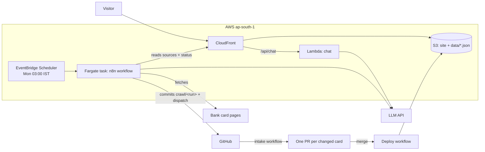

# CardRadar on AWS — Verified Card Catalog (Design Spec)

- **Status:** Approved in chat 2026-09-22, awaiting review of this document
- **Revision 2 (2026-09-22):** AWS serverless hosting, n8n crawler, GitHub pull-request review, every Indian card, everyday users. Replaces revision 1 (2026-09-13: single VPS, Postgres, admin page, premium cards first).
- **Implemented by:** `docs/superpowers/plans/2026-09-22-serverless-site.md` (plan 1) and `docs/superpowers/plans/2026-09-22-n8n-refresh-pipeline.md` (plan 2)

## Context

CardRadar helps an everyday person in India pick the credit card that suits them. It lists the country's cards with their fees, rewards and benefits, and explains how cards work so nobody loses money using one. It is a free public site with no affiliate links.

The work is split into sub-projects. Each gets its own spec → plan → build:

| # | Sub-project | Spec |
|---|---|---|
| 1 | **Serverless site**: every card as static data on S3 + CloudFront, verification labels, security fixes, chat as one Lambda, automatic deploys | this document |
| 2 | **n8n refresh pipeline**: weekly crawl of each card's official page, AI extraction with source quotes, one GitHub pull request per changed card | this document |
| 3 | **Card finder**: a few questions (income, age, spending, fee tolerance) → cards the user qualifies for, ranked by estimated yearly value, computed in the browser | to be designed |
| 4 | **Knowledge hub**: plain-language articles on how cards work and how to avoid losses (interest, minimum-due trap, credit score, fees, forex markup, EMI traps) | to be designed; can be written in parallel with 1–2 |

### Problems this solves

1. The whole site redirects to `/login.html` (`public/app.js` runs on every page), so visitors and search engines see nothing.
2. 74 of the 134 cards have benefits, reward rates and eligibility guessed from the category name by `generate_cobranded.js`.
3. Benefits change often and nothing detects it.
4. Hosting needs a server, Postgres and sessions for what is a read-only catalog.

## Decisions

| Topic | Decision |
|---|---|
| Hosting | AWS, serverless: S3 + CloudFront for the site, one Lambda for chat, region `ap-south-1` (Mumbai) |
| Crawling | n8n, run as a weekly scheduled Fargate task (EventBridge Scheduler), Mondays 03:00 IST |
| Review | One GitHub pull request per changed card; merging publishes |
| Accounts | Login removed; no user data is stored |
| AI chat | Kept, as one Lambda behind CloudFront with request limits |
| Cards | All cards we have (154 after cleanup); more are added as data files |
| Audience | Everyday users first; premium cards remain first-class |
| Money | No affiliate links; see "Follow-ups" |

## Architecture

- **Source of truth:** `data/cards/<id>.json` (one file per card) and `data/status.json` (crawl state) in the Git repository. There is no database.
- **Build:** `scripts/build.js` validates every card file and writes `public/data/cards.json` (site and chat), `public/data/sources.json` (crawler input), `public/data/status.json` (crawler state) and `lambda/chat/cards.json`.
- **Deploy:** GitHub Actions (`deploy.yml`) on every push to `main`: test, build, upload to S3, update the chat Lambda's code, invalidate CloudFront. It uses an OIDC role, so there are no stored AWS keys.

## 1. Card data

### Card file (`data/cards/<id>.json`)

| Field | Type | Notes |
|---|---|---|
| `id` | string | lowercase words joined by hyphens; equals the file name |
| `name`, `bank`, `network`, `category` | string | required |
| `tier` | `entry \| mid \| premium \| super_premium \| private` | see rules below |
| `isLTF`, `isCoBranded` | boolean | |
| `annualFee` | integer ₹ | required |
| `joiningFee` | integer ₹ or null | null = not known yet |
| `rewardRate` | string or null | free text, e.g. `3.3%`, `5X dining` |
| `applyUrl` | https URL on an allowed domain | |
| `benefits` | object or null | today's shape (`cashback`, `lounges`, `golf`, `fuel`, `dining`, `movies`, `forex`, `other`); null = not verified yet |
| `eligibility` | `{ minIncome, minAge }` | integers or null |
| `highlights` | string[] | |
| `popularityScore` | integer | ordering hint only; no longer displayed |
| `sources` | `[{ kind: "product_page", url }]` | at most one per card for now |
| `verification` | `{ <field>: { quote, url, verifiedAt } }` | written only by merged pull requests |

Lounge and railway counts are **per year**; `-1` means unlimited.

### Verified fields

The crawler extracts and verifies these nine facts: `annualFee`, `joiningFee`, `rewardRate`, `loungeDomestic`, `loungeInternational`, `golf`, `forexMarkup`, `minIncome`, `minAge`. They map to card paths in `scripts/fields.js`.

A value is a **claim** when the site presents it as a fact: any fee, rate or eligibility value that isn't null, a lounge count that isn't 0, or golf set to `true`. Absent perks ("no lounge") are not claims, because bank pages rarely state them.

### Status shown on the site (computed by `scripts/build.js`)

- **verified:** every claim has a `verification` entry.
- **stale:** the card has at least one verification, and its page either failed 3 checks in a row or has gone 45 days without a successful check.
- **unverified:** anything else.
- **hasPendingChanges:** `status.json` has `cards[id].pendingSince` and no verification on the card is newer than that date. This happens while the card's refresh pull request is open.
- **lastVerifiedAt:** the oldest quote date among the claims. **lastCheckedAt:** the latest successful page check.

### Migration (one-time, plan 1)

- Source: `cards/*.js` plus the Excel "Co-branded Cards" sheet.
- Drop 10 generated duplicates of hand-curated cards. Add 30 co-branded cards missing from the site. Skip the discontinued Paytm SBI SELECT, and 2 rows already present under another name.
- For the 74 generated cards, keep only the Excel's own columns: name, bank, network, category, fee, LTF, apply link. Their `benefits`, `rewardRate`, `joiningFee`, eligibility and highlights become null or empty.
- Convert per-quarter lounge counts to per-year counts (×4).
- Tier rules:
  - `private` if the category says invite only or private.
  - `super_premium` if the fee is ≥ ₹9,999, or the category says super or ultra premium.
  - `premium` if the fee is ≥ ₹2,500, or the category says premium and not entry.
  - `mid` if the fee is ≥ ₹500.
  - `entry` otherwise.
- Result: 154 cards (17 super premium, 33 premium, 52 mid, 50 entry, 2 private) and 152 crawl sources. Axis Olympus and Practo Axis only have a generic listing link, so they get no crawl source.

### Allowed domains

`config/allowed-domains.json` lists the 27 bank and fintech domains used today. Every `applyUrl`, source URL and verification URL must be `https:` on one of these domains or a subdomain. Build fails otherwise.

## 2. Site

- **Pages:** `index.html` (landing) and `dashboard.html` (catalog), both public. The login pages, the auth checks and the Express server are removed.
- **Data:** the catalog fetches `/data/cards.json` once. Filtering, sorting, search, stats and bank counts happen in the browser (`public/lib.js`, shared with Node tests).
- **Filters:** existing chips (LTF, Premium, Lounge, Railway, Golf, Cashback, Zero Forex), bank chips, search and sort. New: a tier select and a "Verified only" switch. The default sort puts verified cards first.
- **Card grid:** adds a label: ✅ `Verified · Sep 2026`, ⚠️ `May be outdated` (stale or pending changes), or `Unverified`. Cards without benefits show "Benefits not verified yet — see the bank's page". The popularity score is no longer shown.
- **Detail popup:** a verification note at the top (status, last check date, official page link, "confirm on the bank's website before you apply"). Each verified figure has a native `
` "ⓘ Source" showing the quote and date. Unknown values read "Not verified yet".
- **Disclaimer** in every footer: details can change; CardRadar is not a bank and this is not financial advice.
- **Security:**
  - All card-derived text is inserted through `escapeHtml`.
  - Links render only if `https:`, and the build enforces allowed domains.
  - Chat replies are escaped before the light markdown is applied.
  - CloudFront adds the managed SecurityHeadersPolicy.

### Chat (`lambda/chat/index.js`)

- **Endpoint:** `POST /api/chat` through CloudFront to a Lambda function URL (auth type NONE). CloudFront adds an `X-Origin-Verify` header; the function rejects requests without it.
- **Limits:**
  - Messages are 1–500 characters.
  - History keeps the last 10 turns, at 2,000 characters each.
  - Replies are capped at 1,024 tokens.
  - The LLM call times out after 55 s; the Lambda timeout and the CloudFront read timeout are 60 s.
  - Reserved concurrency is 5. This is a parameter; 0 turns it off on accounts whose concurrency quota is 10.
- **Model:** `moonshotai/kimi-k2.5` through the NVIDIA NIM OpenAI-compatible endpoint, as today. The API key is read from the SSM SecureString `/cardradar/llm-api-key` once per container.
- **System prompt:** built from `cards.json`, including each card's data status. The model must say when a card is unverified or stale, and must say it is not a financial adviser.

## 3. AWS (`infra/cardradar.yml`, one CloudFormation stack `cardradar` in `ap-south-1`)

**Plan 1 resources:**
- Private S3 bucket, with CloudFront Origin Access Control and a bucket policy scoped to the distribution.
- The CloudFront distribution:
  - PriceClass_200, which includes India edge locations.
  - HTTP/2 and HTTP/3.
  - Managed CachingOptimized for the site.
  - `/api/*` goes to the function URL with CachingDisabled and AllViewerExceptHostHeader.
- The chat Lambda (Node 22, arm64, 256 MB), its role (logs plus `ssm:GetParameter` on the key), the function URL, and both public-invoke permissions (`lambda:InvokeFunctionUrl`, and `lambda:InvokeFunction` with `InvokedViaFunctionUrl`).
- A GitHub OIDC provider (optional parameter) and a deploy role limited to `repo:<owner>/<repo>:ref:refs/heads/main`. It can sync the bucket, invalidate the distribution, update the chat code and (plan 2) push to ECR.

**Plan 2 resources:**
- An ECR repository (keeps 5 images) and a log group (30-day retention).
- An ECS cluster and a Fargate task definition (1 vCPU, 2 GB, x86_64) with the execution role reading the two SSM secrets.
- An outbound-only security group, the scheduler role, and the weekly schedule. The task runs in the default VPC's public subnets with a public IP, so there is no NAT gateway.

The stack is deployed by hand with `aws cloudformation deploy`. CI only publishes content.

**Estimated cost at launch:** about $1/month. CloudFront, Lambda and S3 stay inside the always-free tiers at low traffic. About 2 hours of Fargate a month is roughly $0.10. ECR and logs cost cents. LLM usage is billed by the LLM provider.

## 4. Weekly refresh (plan 2)

### Crawler (n8n 2.39.10, `n8n/refresh-cards.json`, image `n8n/Dockerfile`)

- The container imports the workflow into a throwaway n8n and runs `n8n execute --id=cardradarRefresh`, then exits. The exit code is `1` on failure.
- Settings come from environment variables: `SITE_URL`, `GITHUB_API`, `GITHUB_REPO`, `LLM_URL`, `LLM_MODEL`, and the secrets `LLM_API_KEY` and `GITHUB_TOKEN`. The GitHub token is a fine-grained token for this repository only, with Contents: read and write and Actions: read and write.
- Steps:
  1. Read `status.json` and `sources.json` from the site.
  2. Create branch `crawl/<runId>` from `main`.
  3. For each source (2 s apart): fetch the page (3 tries, 30 s timeout), strip scripts, styles, head, nav and footer, then compute a SHA-256 fingerprint of the page text.
  4. For a page whose fingerprint changed, send the text (at most 60,000 characters) to the LLM. The prompt asks for the nine fields, each with a verbatim `quote`.
  5. Commit `crawl/<runId>/<sourceId>.json` (page text, fingerprint, extraction).
  6. Commit `crawl/<runId>/_run.json`, which records each source's result (unchanged, changed, failed).
  7. Dispatch the `intake.yml` workflow.
- **Verified locally:** the image runs against a mock of the site, the LLM and GitHub. Unchanged pages skip the LLM, missing pages are retried then recorded, and a failed run exits `1`.

### Intake (`scripts/intake.js` + `.github/workflows/intake.yml`)

- For each changed page, validation keeps a field only if its value passes type and range checks and its quote appears on the page (ignoring spacing and case). Everything dropped is listed in the run report.
- Comparison with the card:
  - A field with no verification yet becomes **confirm** (even if the value is the same).
  - A verified field with a new value becomes **change**.
  - A verified field that matches is left alone.
  - A verified field missing from the page is reported, never removed.
- Warnings: a large fee change (over 3× either way, or to 0), and a benefit removed (lounges to 0, golf to false).
- Applying a proposal sets the value (creating `benefits` if it was null), records `{ quote, url, verifiedAt }`, and removes a `description` that the change made wrong.
- **Output:** one branch and pull request per card (`refresh/<cardId>`, label `card-refresh`). The PR description lists each change as old → proposed with its quote. A new run updates the open PR instead of opening a duplicate. The reviewer edits the file in the PR if the AI misread something, then merges to publish or closes to reject.
- **Crawl state** (`data/status.json`) is committed to `main`:
  - per source: `hash`, `lastCheckedAt`, `consecutiveFailures`, `lastError`
  - per card with an open PR: `pendingSince`

  A page that changed but couldn't be processed keeps its old fingerprint, so it is retried next week.
- **Report:** a comment on the "Weekly crawl reports" issue, which triggers a GitHub notification. It lists counts, failed pages, rejected AI answers and verified values no longer found.
- Finally the intake workflow deletes the crawl branch and dispatches `deploy.yml`. It does this explicitly because pushes made with `GITHUB_TOKEN` don't trigger other workflows.

## Error handling

| Failure | Behaviour |
|---|---|
| Bank page blocks or fails | 3 tries, then recorded. After 3 failed weeks, a verified card shows "May be outdated" |
| LLM error or unparseable reply | Page kept for next week (old fingerprint), listed in the report |
| AI quote not on the page / bad value | Field dropped, listed in the report |
| Page no longer mentions a verified value | Listed in the report or the PR; value unchanged |
| Crawler run fails | Task exits 1 (visible in ECS and the logs); nothing is committed after the failure point |
| Invalid card data merged by hand | Deploy workflow fails at build, so the site keeps the last good version |
| Chat LLM down or slow | Friendly 502 message; the site is unaffected |
| Direct calls to the function URL | 403 (missing origin header) |

## Testing

- **Node's built-in test runner** (`npm test` builds the data first, then runs `node --test`). Covered:
  - card validation, verification status, staleness and pending changes (`test/build.test.js`)
  - escaping, link filtering, filters, sorting, stats, labels and chat markdown (`test/lib.test.js`)
  - the chat handler: origin check, limits, the LLM request and failures (`test/chat.test.js`)
  - quote validation, comparison, applying changes, a whole intake run, and state updates (`test/intake.test.js`)
- **Templates and workflows:** `cfn-lint` on `infra/cardradar.yml`, and `actionlint` on the workflows.
- **Crawler:** a local image run against `n8n/mock-apis.js`.
- **Manual:** browser checks of the catalog, filters, popup and chat, then the first real crawl on AWS.

## Removed

`server.js`, `auth.js`, `db.js`, `knowledgebase.js`, `analyzer.js`, `generate_cobranded.js`, `cards/`, `public/login.html`, `public/login.js`, `docker-compose.yml`, and every npm dependency. The site, scripts and tests use only Node's standard library.

## Follow-ups (not in plans 1–2)

- **Before public launch:** check the NVIDIA NIM API's terms for production traffic. Switching providers only changes `LLM_URL`, `LLM_MODEL` and the key.
- A custom domain: an ACM certificate in `us-east-1`, a CloudFront alias and DNS.
- Rotating the GitHub token yearly (fine-grained tokens expire).
- PDF sources (terms documents), which need a PDF text step in the workflow.
- Invite-only and private-banking cards (Axis Burgundy Private, ICICI Emeralde Private Metal, Kotak Solitaire and White Reserve, Amex Centurion). Add them as card files with sources.
- A Content-Security-Policy header. This needs the inline `onclick` handlers replaced first.
- Privacy-friendly analytics, an AWS budget alert, and monetization (display ads, affiliate networks with a published ranking policy, or a paid data API), once there is traffic.
